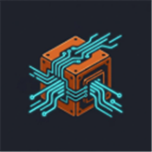

<p align="center">
  
</p>

# Upmarto

[](https://github.com/mertcaliskanlinux/upmarto/actions/workflows/ci.yml)
[](LICENSE)
[](https://www.rust-lang.org/)

**Memory and Reasoning for AI Agents** — local-first session capture, timeline replay, and deterministic root-cause explanations.

## Repository layout

| Path | Description |
|------|-------------|
| [`agent-blackbox/`](agent-blackbox/) | Upmarto monorepo — backend, SDKs, CLI, IDE integrations |
| [`agent-blackbox/upmarto-sdk-rust/`](agent-blackbox/upmarto-sdk-rust/) | Rust SDK (`upmarto-sdk` on crates.io) |
| [`agent-blackbox/upmarto-cli/`](agent-blackbox/upmarto-cli/) | CLI (`upmarto-cli`) |
| [`agent-blackbox/upmarto-sdk-ts/`](agent-blackbox/upmarto-sdk-ts/) | TypeScript SDK (`@upmarto/sdk`) |
| [`agent-blackbox/upmarto-cursor/`](agent-blackbox/upmarto-cursor/) | Cursor hooks (`@upmarto/cursor`) |
| [`agent-blackbox/upmarto-vscode/`](agent-blackbox/upmarto-vscode/) | VS Code extension |

## Quick start

```bash
cd agent-blackbox
cargo run
cargo run -p upmarto-cli -- init
cargo run -p upmarto-cli -- workflow
cargo run -p upmarto-cli -- explain
```

Full documentation: [agent-blackbox/README.md](agent-blackbox/README.md) · [Kullanıcı rehberi (TR)](agent-blackbox/docs/USER_GUIDE.md)

## Community

- [Contributing](CONTRIBUTING.md)
- [Security](SECURITY.md)
- [Code of Conduct](CODE_OF_CONDUCT.md)
- [Issues](https://github.com/mertcaliskanlinux/upmarto/issues)

## License

MIT — see [agent-blackbox/LICENSE](agent-blackbox/LICENSE).
